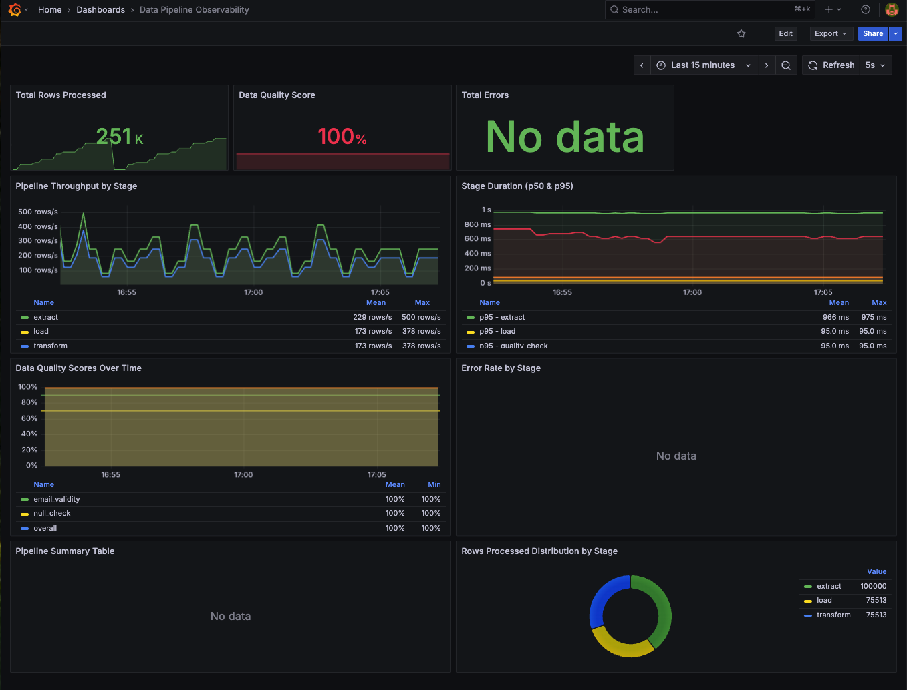

# VictoriaMetrics for Data Pipeline Observability

A comprehensive, production-ready example of using **VictoriaMetrics** for data pipeline observability with **Polars**, **DuckDB**, **Grafana**, and **LLM-powered query interfaces**.

This project demonstrates all concepts from the blog post with working, end-to-end code that you can run locally with Docker.



## 🌟 Features

### Core Observability Stack
- **VictoriaMetrics** - High-performance time-series database (7x less RAM than Prometheus)
- **vmagent** - Lightweight metrics scraper (15MB binary) with push/pull support
- **Grafana** - Visualization with dashboards
- **VictoriaLogs** - Log storage and querying
- **VictoriaTraces** - Distributed tracing backend

### Data Pipeline Instrumentation
- **Polars** ETL pipeline with comprehensive metrics tracking
- **Prometheus client** integration for standard metrics
- **Direct push** to VictoriaMetrics via Prometheus format
- Track: row counts, stage duration, data freshness, quality scores, errors

### Advanced Features
- **DuckDB Integration** - Query VictoriaMetrics directly from SQL
- **Join metrics with business data** - Correlate pipeline performance with revenue
- **Export to Parquet** - Long-term metrics analysis outside TSDB
- **LLM-powered queries** - Natural language to PromQL via OpenAI function calling
- **Anomaly detection** - Automatic threshold-based alerting

## 📊 What Gets Tracked

| Metric | Description | Use Case |
|--------|-------------|----------|
| `pipeline_rows_processed_total` | Rows processed per stage | Throughput monitoring |
| `pipeline_stage_duration_seconds` | Time spent in each stage | Performance bottlenecks |
| `pipeline_data_quality_score` | Quality scores (0-100) | Data validation |
| `pipeline_data_freshness_seconds` | Age of most recent data | SLA monitoring |
| `pipeline_errors_total` | Error counts by type/stage | Reliability tracking |
| `pipeline_output_size_bytes` | Output file sizes | Storage planning |

## 🚀 Quick Start

### Prerequisites
- Docker & Docker Compose
- Python 3.11+
- [uv](https://github.com/astral-sh/uv) package manager
- OpenAI API key (optional, for LLM features)

### 1. Clone and Setup

```bash
cd data-ai-metrics-victoriametrics

# Create .env file
cp .env.example .env
# Edit .env and add your OPENAI_API_KEY (optional)
```

### 2. Start Infrastructure

```bash
# Start all services (VictoriaMetrics, vmagent, Grafana, etc.)
docker compose up -d

# Verify services are running
docker compose ps
```

Services will be available at:
- **VictoriaMetrics**: http://localhost:8428
- **vmagent**: http://localhost:8429
- **Grafana**: http://localhost:3000 (admin/admin)
- **VictoriaLogs**: http://localhost:9428
- **VictoriaTraces**: http://localhost:10428

### 3. Install Python Dependencies

```bash
# Using uv (recommended)
uv sync

# Or with pip
pip install -e .
```

### 4. Setup Grafana Datasources

**Important:** Grafana datasources must be configured manually due to dynamic UIDs.

1. **Open Grafana**: http://localhost:3000
2. **Login**: admin / admin (skip password change)
3. **Add VictoriaMetrics datasource**:
   - Go to **Configuration** (⚙️) → **Data sources** → **Add data source**
   - Search for "VictoriaMetrics"
   - Name: `VictoriaMetrics`
   - URL: `http://victoriametrics:8428`
   - Click **Save & Test** → Should show green ✅
   - Toggle **Default** ON

4. **Import Dashboard**:
   - Go to **Dashboards** → **Import**
   - Click **Upload JSON file**
   - Select `grafana/dashboards/pipeline-observability.json`
   - Click **Import**

**OR use the automated script:**
```bash
./setup_grafana.sh
```

### 5. Run the Data Pipeline

```bash
# Start the Polars ETL pipeline with metrics instrumentation
uv run python polars_pipeline.py
```

This will:
- Start a Prometheus metrics server on port 8000
- Generate sample e-commerce data using Faker
- Run ETL pipeline (extract → transform → quality checks → load)
- Push metrics to VictoriaMetrics
- Repeat every 45 seconds with varying data sizes

**Expected output:**
```
INFO - Starting Prometheus metrics server on port 8000...
INFO - Metrics available at http://localhost:8000/metrics
INFO - Starting ETL pipeline: etl_pipeline
INFO - [EXTRACT] Extracted 10000 rows
INFO - [TRANSFORM] Transformed 7542 rows
INFO - [QUALITY_CHECK] Quality Score: 98.45/100
INFO - [LOAD] Loaded 7542 rows to output/data.parquet
INFO - Pipeline completed successfully in 2.34s
```

### 6. View Grafana Dashboard

1. Open http://localhost:3000
2. Navigate to **Dashboards** → **Data Pipeline Observability**
3. **OR** go directly to: http://localhost:3000/d/pipeline-observability

You'll see:
- Total rows processed (live counter)
- Data quality score (0-100%)
- Throughput by stage (rows/second)
- Stage duration (p50 & p95)
- Quality trends over time
- Error rates

**Note:** Wait 30-60 seconds for first metrics to appear (vmagent scrapes every 30s).

### 7. Run DuckDB Analytics

```bash
# Query VictoriaMetrics from DuckDB
uv run python duckdb_analytics.py
```

This demonstrates:
- Fetching metrics via VictoriaMetrics HTTP API
- Converting to Polars/Pandas DataFrames
- Running SQL analytics on time-series data
- Exporting to Parquet for long-term analysis
- Joining pipeline metrics with business data
- Anomaly detection

### 8. Try LLM-Powered Queries (Optional)

Requires `OPENAI_API_KEY` in .env file.

```bash
# Demo mode - runs example questions
uv run python llm_metrics_query.py

# Interactive mode - ask your own questions
uv run python llm_metrics_query.py --interactive
```

**Example natural language queries:**
- "How many total rows have been processed?"
- "What's the current data quality score?"
- "Which ETL jobs failed today?"
- "Show me the throughput rate for each pipeline stage"

## 📁 Project Structure

```
data-ai-metrics-victoriametrics/
├── docker-compose.yml              # All infrastructure services
├── pyproject.toml                 # Python dependencies (uv)
├── .env.example                   # Configuration template
├── README.md                      # This file
│
├── polars_pipeline.py             # Main ETL pipeline with metrics
├── polars_pipeline_with_logs.py   # Pipeline with VictoriaLogs integration
├── duckdb_analytics.py            # DuckDB + VictoriaMetrics analytics
├── llm_metrics_query.py           # LLM-powered natural language queries
├── openai_conn.py                 # OpenAI tracing example (bonus)
│
├── grafana/
│   └── dashboards/
│       └── pipeline-observability.json  # Dashboard (import manually)
│
├── setup_grafana.sh               # Dashboard import script
├── Makefile                       # Convenience commands
├── run_demo.sh                    # Interactive launcher
├── verify_setup.py                # Health checks
│
└── output/                        # Pipeline outputs (created at runtime)
    ├── data.parquet              # Transformed data
    └── metrics_export.parquet    # Exported metrics
```

## 🔧 Configuration

### Environment Variables (.env)

```bash
# Required for LLM features
OPENAI_API_KEY=sk-...

# Optional: Customize endpoints
VICTORIAMETRICS_URL=http://localhost:8428
VMAGENT_URL=http://localhost:8429
```

### Custom Metrics

Push custom metrics via Prometheus format:

```python
import requests

line = 'custom_metric{label1="value1",label2="value2"} 123.45 1234567890000'
requests.post('http://localhost:8428/api/v1/import/prometheus', data=line)
```

## 📈 Viewing Logs in Grafana

The project includes VictoriaLogs for centralized logging.

### View Existing Logs

1. **Open Grafana Explore**: http://localhost:3000/explore
2. **Select datasource**: **VictoriaLogs** (dropdown at top)
3. **Run query**:
   ```logql
   {service_name="random_joke_generator"}
   ```

### Send Pipeline Logs to VictoriaLogs

Run the pipeline with logging support:

```bash
uv run python polars_pipeline_with_logs.py
```

Then query in Grafana:
```logql
{service_name="polars_pipeline"}
```

### Log Query Examples

```logql
# All logs
{}

# Filter by service
{service_name="polars_pipeline"}

# Filter by level
{service_name="polars_pipeline"} | level = "ERROR"

# Search in message
{service_name="polars_pipeline"} | "Pipeline Iteration"

# Filter by stage
{service_name="polars_pipeline"} | stage = "completed"
```

## 🐛 Troubleshooting

### Dashboard Shows "Datasource not found"

**Cause:** Dashboard expects datasource with specific UID, but yours has different UID.

**Solution 1:** Recreate datasource with correct name:
1. Go to Configuration → Data sources
2. Make sure datasource is named exactly **"VictoriaMetrics"**
3. Re-import dashboard

**Solution 2:** Update dashboard JSON:
```bash
# Get your datasource UID from Grafana UI
# Then replace in dashboard:
sed -i '' 's/"uid":"VictoriaMetrics"/"uid":"YOUR_UID_HERE"/g' grafana/dashboards/pipeline-observability.json

# Re-import dashboard
```

### Dashboard is Empty (No Data)

**Checks:**
```bash
# 1. Is pipeline running and exposing metrics?
curl http://localhost:8000/metrics | grep pipeline_rows

# 2. Can vmagent reach the pipeline?
docker compose logs vmagent | grep -i error

# 3. Does VictoriaMetrics have data?
curl 'http://localhost:8428/api/v1/query?query=pipeline_rows_processed_total'

# 4. Wait 30-60 seconds for first scrape
```

### vmagent Can't Scrape Pipeline

**Issue:** Docker can't reach `host.docker.internal:8000`

**Fix for Linux** (add to docker-compose.yml under vmagent):
```yaml
  vmagent:
    extra_hosts:
      - "host.docker.internal:host-gateway"
```

Then: `docker compose restart vmagent`

### DuckDB Analytics Error

Make sure pandas is installed:
```bash
uv sync  # or pip install pandas
```

### No Logs Visible in VictoriaLogs

**Check:**
1. Are you in the correct datasource? (VictoriaLogs, not VictoriaTraces)
2. Run test: `uv run python test_logs.py`
3. Query: `{service_name="polars_pipeline"}`

## 🎓 Learning Outcomes

After running this project, you'll understand:

1. **VictoriaMetrics fundamentals**
   - Query API, PromQL, data model
   - vmagent configuration and scraping
   - Storage and performance characteristics

2. **Data pipeline observability**
   - What metrics matter (not just CPU/RAM)
   - Instrumenting data transformations
   - Quality monitoring and SLAs

3. **Modern data stack integration**
   - Polars for fast data processing
   - DuckDB for analytics on metrics
   - Grafana for visualization
   - LLMs for natural language interfaces

4. **Production patterns**
   - Metric labeling strategies
   - Dashboard design
   - Alerting thresholds
   - Long-term storage with Parquet

## 📚 Additional Resources

### VictoriaMetrics Documentation
- [Official Docs](https://docs.victoriametrics.com/)
- [PromQL Guide](https://docs.victoriametrics.com/MetricsQL.html)
- [vmagent Documentation](https://docs.victoriametrics.com/vmagent.html)

### Related Projects
- [Polars Documentation](https://pola-rs.github.io/polars/)
- [DuckDB Documentation](https://duckdb.org/docs/)
- [Prometheus Client Python](https://github.com/prometheus/client_python)

## 🤝 Contributing

This is a learning/demo project. Feel free to:
- Add more pipeline examples
- Create additional Grafana dashboards
- Implement alerting rules
- Add more LLM query examples
- Improve documentation

## 📝 License

MIT License - feel free to use this code for learning or production.

---

**Ready to start?** Run `docker compose up -d && uv run python polars_pipeline.py` and open Grafana at http://localhost:3000! 🚀
